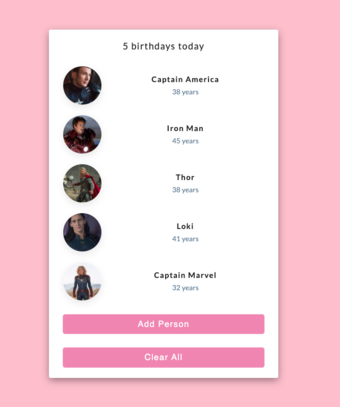

## Birthday Reminder

Original Birthday reminder project: 

Youtube: [https://youtu.be/a_7Z7C_JCyo](https://youtu.be/a_7Z7C_JCyo)

Actual Project live: [https://react-projects-1-birthday-reminder.netlify.app/](https://react-projects-1-birthday-reminder.netlify.app/)

### What were my modifications?

1. Having the data in a JSON file
2. Ability to add people to JSON file via Add button
3. Ability to delete people from JSON file via Clear All button

### Getting Started on Local Environment

In the project directory, you can run:

### npm install node_modules

### npm start

This runs the app in the development mode - 

Open [http://localhost:3000](http://localhost:3000) to view it in your browser.

In this project we are using [json-server](https://github.com/typicode/json-server) - this allows us to create a rest api to post + delete from, for more information on this specifically: please view the GitHub page linked.

In another terminal tab, you will go to your project directory and run:

### npx json-server --watch src/data.json --port 4000

—watch -> watches your files for requests made

src/data.json -> path to my data.json file

— port 4000 -> specifying to open on port 4000. Without specifying, it opens on 3000 which is where our react project is.

To view in local -> [http://localhost:4000/people](http://localhost:8000/people)

Happy viewing :)

